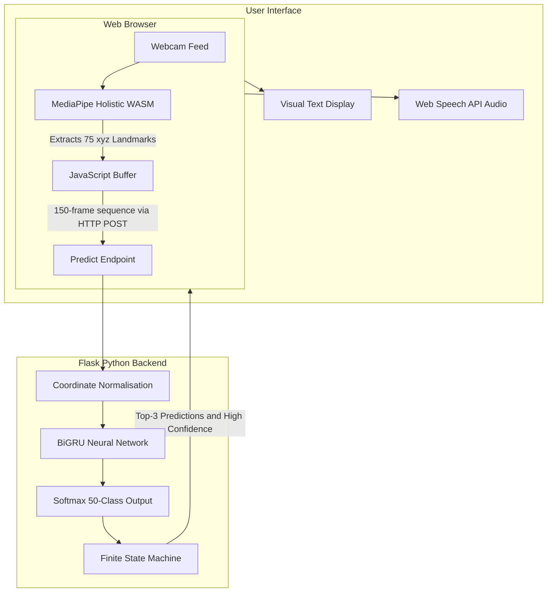

# SignSense: Real-Time Sign Language Recognition 

> An accessible, browser-based American Sign Language (ASL) recognition system powered by Deep Learning and Computer Vision.

---

## System Demo

*(Embed your animated GIF or YouTube video link here showing the system translating a sign in real-time with the TTS announcing the word)*

---

##  Overview

**SignSense** is an undergraduate final-year project designed to bridge the communication gap between the Deaf and Hard-of-Hearing (DHH) community and the hearing majority. 

**Author:** Adesanya Emmanuel Olasunkanmi (University of Ilorin)

Unlike many existing systems that only translate static alphabets (fingerspelling) or require expensive hardware (like depth cameras or sensor gloves), SignSense translates **dynamic, word-level ASL signs in real-time** using only a standard laptop webcam.

The system is trained on a 50-word vocabulary and achieves **92.7% accuracy** on unseen data by tracking 75 distinct body and hand landmarks.

---

##  How It Works (For Non-Technical Users)

SignSense works entirely in your browser without needing to upload your video to the cloud. Here is the step-by-step process:

1. **See:** When you stand in front of your webcam, the system uses Google's MediaPipe technology to draw an invisible "digital skeleton" over your body and hands. 
2. **Track:** It tracks exactly how your hands and arms move over a 5-second window. It doesn't record the video itself, just the mathematical coordinates of your joints (which protects your privacy).
3. **Understand:** An Artificial Intelligence model (a Bidirectional GRU neural network) analyses the pattern of your movement and compares it against thousands of hours of ASL training data.
4. **Speak:** Once the AI is highly confident it has recognised the word, it displays the text on the screen and uses the browser's built-in voice synthesizer to announce the word aloud.

---

##  System Architecture

The project decouples heavy computer vision tracking from the neural network inference to maintain real-time performance on standard laptops.

---

##  Performance & Results

The deep learning model was trained using a highly refined subset of the **ASL Citizen** dataset. The model evaluates sequences of 150 frames, with each frame containing a 225-dimensional coordinate vector.

| Metric | Score |
|---|---|
| **Test Accuracy** | **92.72%** |
| **Top-3 Accuracy** | **96.76%** |
| Macro Precision | 93.12% |
| Macro Recall | 92.79% |
| Macro F1-Score | 92.78% |

> *Note: The system achieves a 95% reduction in memory overhead by processing structural keypoints rather than raw 720p video arrays, making it highly efficient for edge-device deployment.*

##  Vocabulary

The system currently recognises the following 50 words:
> *AXE, BASKETBALL, BEE, BELIEVE, BELT, BITE, BREAKFAST, CALENDAR, CANCEL, CANCER, CHRISTMAS, CLOUD, CONFUSED, DARK, DEAF, DECIDE, DEMAND, DINNER, DOG, DOWNSIZE, DRAG, EAT, EDIT, ELEVATOR, FINE, FOREIGNER, GUESS, HALLOWEEN, HOSPITAL, LETTUCE, LOCK, LUNCH, MECHANIC, MICROSCOPE, MOVIE, NIGHT, NOON, PARTY, PATIENT, RECENT, RESEARCH, RIVER, ROCKINGCHAIR, SHAVE, SPECIAL, TAKEOFF, THIRD, TWINS, TYPE, WHATFOR*

---

##  License & Academic Use

This project is licensed under the **Creative Commons Attribution-NonCommercial 4.0 International (CC BY-NC 4.0)** license. 

You are free to share and adapt the material for non-commercial purposes, provided you give appropriate credit.

**Academic Citation:**
If you use this code or methodology in your research, please acknowledge it as follows:
> Adesanya, E. O. (2026). *Development of a Real-Time Word-Level Sign Language Recognition System Using Deep Learning*. Department of Computer Science, University of Ilorin.

---

**Acknowledgements:** 
- Dataset provided by the [ASL Citizen Project](https://github.com/microsoft/ASL-Citizen) (Desai et al., 2023).
- Pose estimation powered by [Google MediaPipe](https://developers.google.com/mediapipe).
